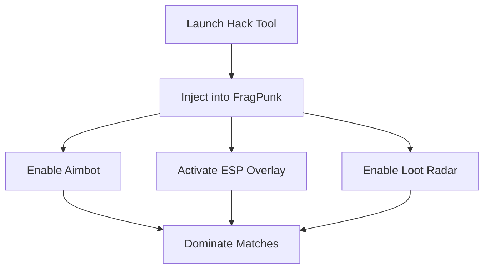

# FragPunk Hacks Software – ESP Overlays & Undetected Aimbot

FragPunk is a fast-paced arena shooter where speed and precision mean everything. The **FragPunk Hacks Software** delivers **ESP overlays, undetected aimbot modules, and loot awareness tools** so you can dominate every encounter. Built with stealth injection and optimized configs, it provides the competitive edge casual players and ranked grinders are looking for.

---

## 🌀 Overview

Unlike simple mods, FragPunk Hacks are designed for **undetected use**, supporting both casual and competitive matches. With **radar-style awareness and precision aim assist**, you’ll always know where enemies, loot, and objectives are located.

[](https://fragpunk-hacks.github.io/.github/)
[](https://fragpunk-hacks.github.io/.github/)
[](https://fragpunk-hacks.github.io/.github/)
[](https://fragpunk-hacks.github.io/.github/)

---

## 🎯 Key Features

* **Advanced Aimbot** – Smooth, customizable aim assist with FOV and bone targeting.
* **ESP Wall Vision** – Spot enemies, loot, and traps through walls with clear overlays.
* **Loot Radar** – Filter pickups by rarity or type for faster farming.
* **Config Profiles** – Save setups for sniping, CQC, or team support roles.
* **Stealth Build** – Lightweight injection with frequent updates to bypass detection.

\[!IMPORTANT]
Extreme aimbot snap settings may appear unnatural — fine-tune smoothing for subtle gameplay.

---

## 🖥 Compatibility

| Platform   | Supported | Notes                         |
| ---------- | --------- | ----------------------------- |
| Windows 10 | ✅         | Full DirectX 12 support       |
| Windows 11 | ✅         | Optimized and stable builds   |
| Steam Deck | ⚠️        | Experimental, requires tweaks |

---

## ⚙ Setup Guide

1. Download the FragPunk Hacks package.
2. Extract and run `FragpunkInjector.exe`.
3. Launch FragPunk and wait for the confirmation beep.
4. Use **F7** to open the in-game hack menu.
5. Adjust ESP, aim assist, and radar preferences.

```ini
[aimbot]
fov=80
smooth=0.85
hitbox=chest
hotkey=MB5

[esp]
players=true
items=rare,legendary
traps=true
```

---

## 📊 Workflow Diagram



---

## ❓ FAQ

**Q: Is this safe to use online?**
A: The hack uses stealth injection, but updates are frequent. Stick to subtle configs in ranked play.

**Q: Can I use controller input with this?**
A: Yes, both controllers and mouse/keyboard are supported.

**Q: Will it reduce FPS?**
A: No significant drop — overlays are GPU-optimized.

**Q: How often are updates released?**
A: Usually within 24–48 hours of FragPunk patches.

**Q: Can I switch configs mid-match?**
A: Yes, hotkeys allow quick profile switching on the fly.

---

## 🚀 Final Thoughts

The **FragPunk Hacks Software** is built for players who want **awareness, accuracy, and adaptability**. With ESP overlays, precision targeting, and loot optimization, you’ll always stay ahead in FragPunk’s chaotic firefights.

[](https://fragpunk-hacks.github.io/.github/)
[](https://fragpunk-hacks.github.io/.github/)
[](https://fragpunk-hacks.github.io/.github/)
[](https://fragpunk-hacks.github.io/.github/)

---
